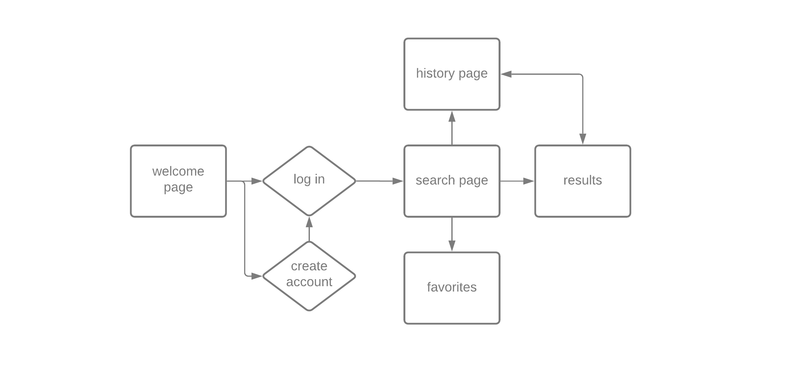
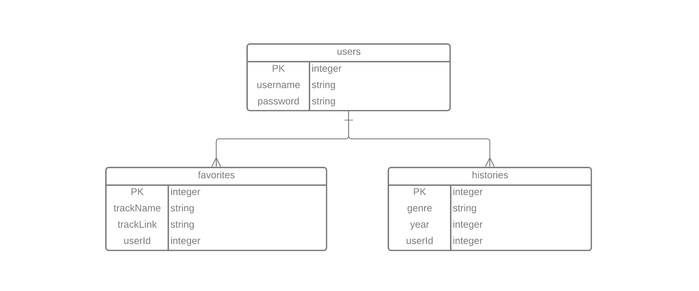
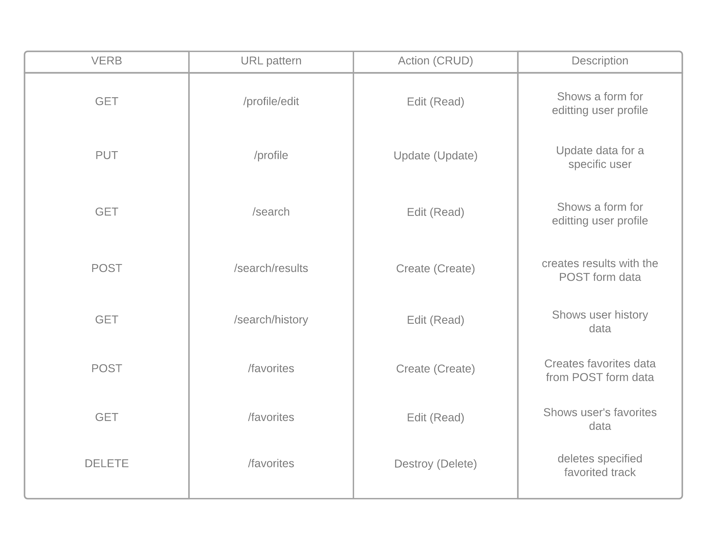

# Music Time Machine

Particularly fond of the music scene from 2009? Or 1987? Revisit an entire past year of music for your favorite genre.

## Tech stack

HTML, CSS, JavaScript, PostgreSQL, Sequelize, Express, Node, EJS

## Wireframes



## Entity Relationship Diagram



## CRUD RESTful Routes



## API

Spotify Web API (client credentials flow)


### Example of how to call/invoke the API, and a description of what data comes back

The Spotify Web API uses REST principles to return JSON metadata from the Spotify Data Catalogue. The client credentials flow, which I will be using for this project, does not ask the site user for their Spotify information; it only authenticates the request via the developer(client) credentials. Below is sample data that I created that includes the GET album method, given a Spotify album ID number. For my actual project, I will be using the GET search method, which incorporates track and track data.

```sh
{
  album_type: 'album',
  artists: [
    {
      external_urls: [Object],
      href: 'https://api.spotify.com/v1/artists/0TnOYISbd1XYRBk9myaseg',
      id: '0TnOYISbd1XYRBk9myaseg',
      name: 'Pitbull',
      type: 'artist',
      uri: 'spotify:artist:0TnOYISbd1XYRBk9myaseg'
    }
  ],
  available_markets: [
    'AD', 'AE', 'AL', 'AM', 'AO', 'AT', 'AZ', 'BA', 'BE', 'BF',
    'BG', 'BH', 'BI', 'BJ', 'BW', 'BY', 'CH', 'CI', 'CM', 'CV',
    'CY', 'CZ', 'DE', 'DJ', 'DZ', 'EE', 'EG', 'ES', 'FI', 'FR',
    'GA', 'GB', 'GE', 'GH', 'GM', 'GN', 'GQ', 'GR', 'GW', 'HR',
    'HU', 'IE', 'IL', 'IT', 'JO', 'KE', 'KG', 'KM', 'KW', 'KZ',
    'LB', 'LI', 'LR', 'LS', 'LT', 'LU', 'LV', 'MA', 'MC', 'MD',
    'ME', 'MG', 'MK', 'ML', 'MN', 'MR', 'MT', 'MU', 'MW', 'MX',
    'MZ', 'NA', 'NE', 'NG', 'NL', 'NO', 'OM', 'PL', 'PS', 'PT',
    'QA', 'RO', 'RS', 'RU', 'RW', 'SA', 'SC', 'SE', 'SI', 'SK',
    'SL', 'SM', 'SN', 'ST', 'SZ', 'TD', 'TG', 'TN', 'TR', 'TZ',
    ... 7 more items
  ],
  copyrights: [
    {
      text: '(P) 2012 RCA Records, a division of Sony Music Entertainment',
      type: 'P'
    }
  ],
  external_ids: { upc: '886443671584' },
  external_urls: { spotify: 'https://open.spotify.com/album/4aawyAB9vmqN3uQ7FjRGTy' },
  genres: [],
  href: 'https://api.spotify.com/v1/albums/4aawyAB9vmqN3uQ7FjRGTy',
  id: '4aawyAB9vmqN3uQ7FjRGTy',
  images: [
    {
      height: 640,
      url: 'https://i.scdn.co/image/ab67616d0000b2732c5b24ecfa39523a75c993c4',
      width: 640
    },
    {
      height: 300,
      url: 'https://i.scdn.co/image/ab67616d00001e022c5b24ecfa39523a75c993c4',
      width: 300
    },
    {
      height: 64,
      url: 'https://i.scdn.co/image/ab67616d000048512c5b24ecfa39523a75c993c4',
      width: 64
    }
  ],
  label: 'Mr.305/Polo Grounds Music/RCA Records',
  name: 'Global Warming',
  popularity: 59,
  release_date: '2012-11-16',
  release_date_precision: 'day',
  total_tracks: 18,
  tracks: {
    href: 'https://api.spotify.com/v1/albums/4aawyAB9vmqN3uQ7FjRGTy/tracks?offset=0&limit=50',
    items: [
      [Object], [Object], [Object],
      [Object], [Object], [Object],
      [Object], [Object], [Object],
      [Object], [Object], [Object],
      [Object], [Object], [Object],
      [Object], [Object], [Object]
    ],
    limit: 50,
    next: null,
    offset: 0,
    previous: null,
    total: 18
  },
  type: 'album',
  uri: 'spotify:album:4aawyAB9vmqN3uQ7FjRGTy'
}
```

## MVP goals

- create users database for storing user login data
- create favorites database for storing user-favorited tracks (1:M one user can have many favorites)
- create results database for storing user's past search queries for genre and year (1:M one user can have many past search queries)
- use Spotify Web API's GET search tracks to populate results for a user-selected year and genre
- using the user data stored in the database, make a page to display the user's past searches and a page displaying their favorited tracks

### Stretch goals
- sort tracks by popularity (this can be returned from GET albums) OR instead of grabbing entire album, grab most popular song from album (this is part of GET track operation)
- explore including a link to the open spotify version of the track (this link is included in the API return)

## Potential roadblocks

- I need to make sure I am adhering to the Spotify development/design guidelines for this app (very detailed and specific requirements for using their API)
- I need to fully understand the differences/limitations of different authorization flows, mainly client credentials vs. authorization code flow