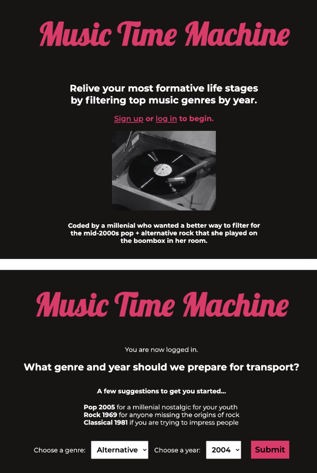

# Music Time Machine

Relive your most formative life stages by filtering top music genres by year. Music Time Machine is a CRUD RESTful API application that utilizes the Node.js environment, Express.js server and a PostgreSQL database. Data is from the Spotify Web API.

## Tech stack

HTML, CSS, JavaScript, PostgreSQL, Sequelize, Express, Node, EJS

## Wireframes


## Entity Relationship Diagram


## API

Spotify Web API (client credentials flow)


### Example of how to call/invoke the API, and a description of what data comes back

The Spotify Web API uses REST principles to return JSON metadata from the Spotify Data Catalogue. The client credentials flow, which I will be using for this project, does not ask the site user for their Spotify information; it only authenticates the request via the developer(client) credentials. Below is sample data that I retrieved using the GET search method, given a genre and release year. The data produced from this request is a mix of track and album data.

```sh
[
  {
    album: {
      album_type: 'album',
      artists: [Array],
      available_markets: [Array],
      external_urls: [Object],
      href: 'https://api.spotify.com/v1/albums/43iBTEWECK7hSnE0p6GgNo',
      id: '43iBTEWECK7hSnE0p6GgNo',
      images: [Array],
      name: 'The Emancipation of Mimi',
      release_date: '2005-01-01',
      release_date_precision: 'day',
      total_tracks: 14,
      type: 'album',
      uri: 'spotify:album:43iBTEWECK7hSnE0p6GgNo'
    },
    artists: [ [Object] ],
    available_markets: [ 'CA', 'MX', 'US' ],
    disc_number: 1,
    duration_ms: 201400,
    explicit: false,
    external_ids: { isrc: 'USIR20500195' },
    external_urls: {
      spotify: 'https://open.spotify.com/track/3LmvfNUQtglbTrydsdIqFU'
    },
    href: 'https://api.spotify.com/v1/tracks/3LmvfNUQtglbTrydsdIqFU',
    id: '3LmvfNUQtglbTrydsdIqFU',
    is_local: false,
    name: 'We Belong Together',
    popularity: 70,
    preview_url: null,
    track_number: 2,
    type: 'track',
    uri: 'spotify:track:3LmvfNUQtglbTrydsdIqFU'
  }
]
```

## MVP goals

- create users database for storing user login data
- create favorites database for storing user-favorited tracks (1:M one user can have many favorites)
- create results database for storing user's past search queries for genre and year (1:M one user can have many past search queries)
- use Spotify Web API's GET search tracks to populate results for a user-selected year and genre
- make a page to display the user's past searches
- make a page displaying their favorite tracks

### Stretch goals
- sort data by popularity (this is derived from albums data)
- pull tracks instead of albums
- explore including a link to the open spotify version of the track (this link is included in the API return)

## CRUD RESTful Routes


## Avoiding potential roadblocks

- I needed to make sure the app adhered to the Spotify development/design guidelines (these guidelines are quite specific)
- I needed to fully understand the differences/limitations of different authorization flows, mainly client credentials vs. authorization code flow
- Project planniing was key to setting up routes/controllers in an organized manner that achieved my project goals

## Local Setup

- Install the LTS version of node.js from [here](https://nodejs.org/en/)
- In a terminal, clone this repo

```sh
git clone https://github.com/Mackmiller/music-time-machine.git 
```

- Navigate to the repo folder

```sh
cd music-time-machine
```

- Install the project dependencies. Note that a .env folder containing API client key and password will need to be created. Information on obtaining these can be found [here](https://developer.spotify.com/documentation/general/guides/authorization/app-settings/)

```sh
npm install
```

- Deploy the project on your local machine

```sh
node index.js
```

- On your browser, navigate to localhost3000 and the Music Time Machine project automatically appears on your locally hosted web page. Here are some project screenshots:
<p align="center">  
  
</p>

## Deployment

The app is also deployed on Heroku and can be accessed [here](https://music-time-machine.herokuapp.com/)
